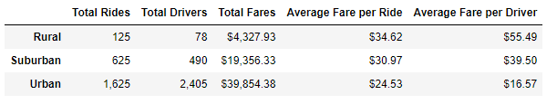
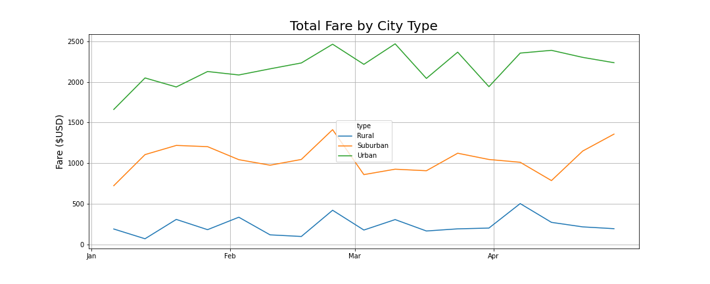

# PyBer_Analysis

## Overview of PyBer Analysis:
The purpose of this analysis was to advise PyBer's CEO on data from ride sharing data categorized by different city types, Urban Suburban, and Rural. Data came in a CSV format and was merged into a cleaner version via python. 
## Resuts of PyBer Analysis:
The data from Jan 2019 to late April 2019 showed the followed:

* Urban
    * The Urban data had the most rides (1,625) and largest amount of drives that totaled over 2,400. The average fare was the lowest per ride ($24.53) and average fare was the lowest per driver ($16.57).
* Suburban
    * Suburban data showed the second most rides and was slightly below Urban area and ranked mid among all categories. 
* Rural 
    * Rural data was the smallest number of rides and total drives. Total % of rides was under 10% for this area. Additionally, this was the higHest fare per ride and driver.  

### Summary:
* Based on the results, three business recommendations for the CEO to address disparities among city types are the following. 

    1. Look at decreasing the ride fares in total rural areas to encourage more ride sharing. Additionally, look ways to find synergies between Rural/Suburban and Rural/Urban areas that encourage increased rides
    2. Encourage drivers to expand their network out of the urban areas to capture potentially more rides in other areas. For example, look at potentially giving drivers a bonus for integrating into other areas. 
    3. Reduce total of drivers in the urban area by either capping the area or furloughing  drivers. 

###